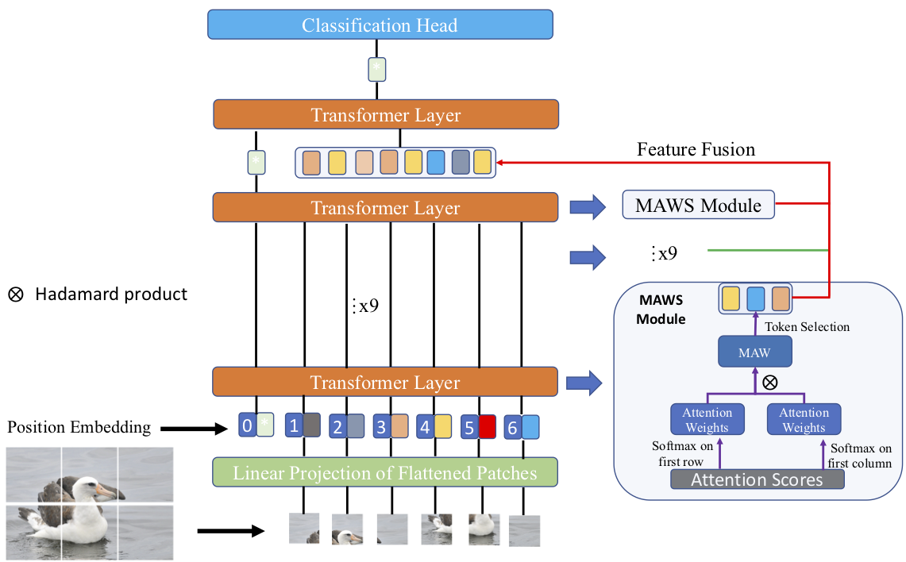

# Feature Fusion Vision Transformer for Fine-Grained Visual Categorization

Official PyTorch implementation of [Feature Fusion Vision Transformer for Fine-Grained Visual Categorization](https://arxiv.org/pdf/2107.02341.pdf) (BMVC 2021). 

If you use the code in this repo for your work, please cite the following bib entries:

    @article{wang2021feature,
      title={Feature Fusion Vision Transformer for Fine-Grained Visual Categorization},
      author={Wang, Jun and Yu, Xiaohan and Gao, Yongsheng},
      journal={arXiv e-prints},
      pages={arXiv--2107},
      year={2021}
    }

## Abstract

The core for tackling the fine-grained visual categorization (FGVC) is to learn subtleyet discriminative features. Most previous works achieve this by explicitly selecting thediscriminative parts or integrating the attention mechanism via CNN-based approaches.However,  these  methods  enhance  the  computational  complexity  and  make  the  modeldominated  by  the  regions  containing  the  most  of  the  objects.   Recently,  vision  trans-former (ViT) has achieved SOTA performance on general image recognition tasks.  Theself-attention mechanism aggregates and weights the information from all patches to theclassification token,  making it perfectly suitable for FGVC. Nonetheless,  the classifi-cation  token  in  the  deep  layer  pays  more  attention  to  the  global  information,  lackingthe local and low-level features that are essential for FGVC. In this work, we proposea novel pure transformer-based framework Feature Fusion Vision Transformer (FFVT)where we aggregate the important tokens from each transformer layer to compensate thelocal, low-level and middle-level information.  We design a novel token selection mod-ule called mutual attention weight selection (MAWS) to guide the network effectivelyand efficiently towards selecting discriminative tokens without introducing extra param-eters.  We verify the effectiveness of FFVT on four benchmarks where FFVT achievesthe state-of-the-art performance.

## Prerequisites

The following packages are required to run the scripts:
- [Python >= 3.6]
- [PyTorch = 1.5]
- [Torchvision]

## Dataset
You can download the datasets from the links below:

+ [CUB-200-2011](http://www.vision.caltech.edu/visipedia/CUB-200-2011.html).
+ [Stanford Dogs](http://vision.stanford.edu/aditya86/ImageNetDogs/)
+ [Cotton and Soy.Loc](https://drive.google.com/drive/folders/1UkWRepieAvEVEn3Z8n1Zx04bASvvqL7G?usp=sharing).

## Training scripts for FFVT on Cotton dataset.
Train the model on the Cotton dataset. We run our experiments on 4x2080Ti/4x1080Ti with the batchsize of 8 for each card.

    $ python3 -m torch.distributed.launch --nproc_per_node 4 train.py --name {name} --dataset cotton --model_type ViT-B_16 --pretrained_dir {pretrained_model_dir} --img_size 384 --resize_size 500 --train_batch_size 8 --learning_rate 0.02 --num_steps 2000 --fp16 --eval_every 16 --feature_fusion

## Training scripts for FFVT on Soy.Loc dataset.
Train the model on the Cotton dataset. We run our experiments on 4x2080Ti/4x1080Ti with the batchsize of 8 for each card.

    $ python3 -m torch.distributed.launch --nproc_per_node 4 train.py --name {name} --dataset soyloc --model_type ViT-B_16 --pretrained_dir {pretrained_model_dir} --img_size 384 --resize_size 500 --train_batch_size 8 --learning_rate 0.02 --num_steps 4750 --fp16 --eval_every 50 --feature_fusion
    
## Training scripts for FFVT on CUB dataset.
Train the model on the Cotton dataset. We run our experiments on 4x2080Ti/4x1080Ti with the batchsize of 8 for each card.

    $ python3 -m torch.distributed.launch --nproc_per_node 4 train.py --name {name} --dataset CUB --model_type ViT-B_16 --pretrained_dir {pretrained_model_dir} --img_size 448 --resize_size 600 --train_batch_size 8 --learning_rate 0.02 --num_steps 10000 --fp16 --eval_every 200 --feature_fusion
    
        
            
## Download  Models

[Trained model Google Drive](https://drive.google.com/drive/folders/1k1vqc0avk_zpCAVuLNZpVX-w-Q3xXf-5?usp=sharing)

## Acknowledgment
Thanks for the advice and guidance given by Dr.Xiaohan Yu and Prof. Yongsheng Gao.

Our project references the codes in the following repos. Thanks for thier works and sharing.
- [ViT-pytorch](https://github.com/jeonsworld/ViT-pytorch)
- [TransFG](https://github.com/TACJu/TransFG)

